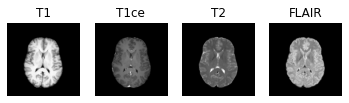
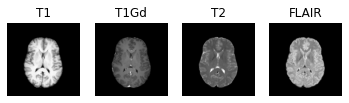
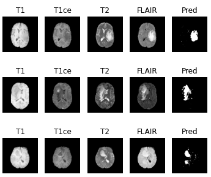

# Brain Tumor Detector

Machine Learning algorithm to detect tumors in medical images of brain slices.





## Requirements

* Python 3
* Linux (other OS were not tested)

* Python packages required are in requirements.txt, install them with :

```sh
pip3 install --user -r requirements.txt
```

## Usage

```sh
jupyter-notebook BrainTumorsDetector.ipynb 
```

## DataSet

Using the **BRATS18 dataset** form the [Multimodal Brain Tumor Segmentation Challenge 2018](https://www.med.upenn.edu/sbia/brats2018.html)

4 Types of scans (of brains):
* T1
* T1ce
* T2
* FLAIR

And the ground truth




## Result of different algorithms

* My metric is the **dice score**, unstead of computing a score on raw pixels, because there is more zones without tumors than with tumors.
> `Dice score = 2⋅number of true positives / (2⋅number of true positives + number of false positives + number of false negatives)`

| Algorithm/Technic      | Dice Score |
|------------------------|------------|
| SVM (SVC)              | 0.713      |
| Multi Layer Preceptron | 0.744      |
| Random Forest          | 0.727      |
| CatBoost               | **0.780**  |

> CatBoost seems to win!




#### PS

> T-34 is for the Russian tank model, because tanks are cool !

