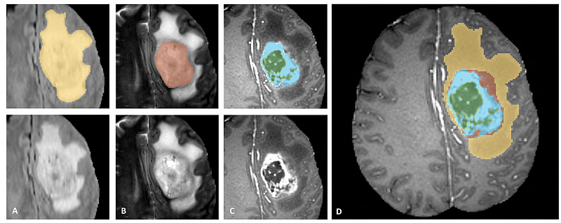
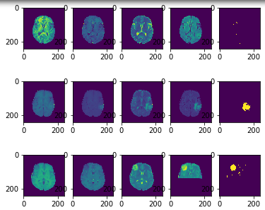

# Brain Tumor Detector

Machine Learning algorithm to detect tumors in medical images of brain slices.



## Requirements

* Python 3
* Linux (other OS were not tested)

* Python packages required are in requirements.txt, install them with :

```sh
pip3 install --user -r requirements.txt
```

## Usage

```sh
jupyter-notebook 
```

## Result of different algorithms

* My metric is the **dice score**, unstead of computing a score on raw pixels, because there is more zones without
    tumors than with tumors.

| Algorithm/Technic      | Dice Score |
|------------------------|------------|
| SVM (SVC)              | 0.70956521 |
| Multi Layer Preceptron | 0.74505052 |
| Random Forest          | 0.74029135 |

> Multi Layer Perceptron (Neural Net) was my final choosen model!



## DataSet

Using the **BRATS18 dataset**

4 Types of scans (of brains):
* T1
* T1ce
* T2
* FLAIR

## Authors

* SidoShiro
* Chazalo (Teacher)

#### PS

> T-34 is for the Russian tank model, because tanks are cool !

